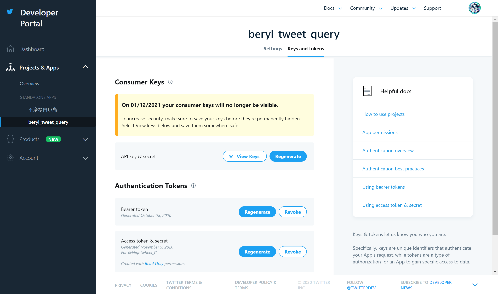
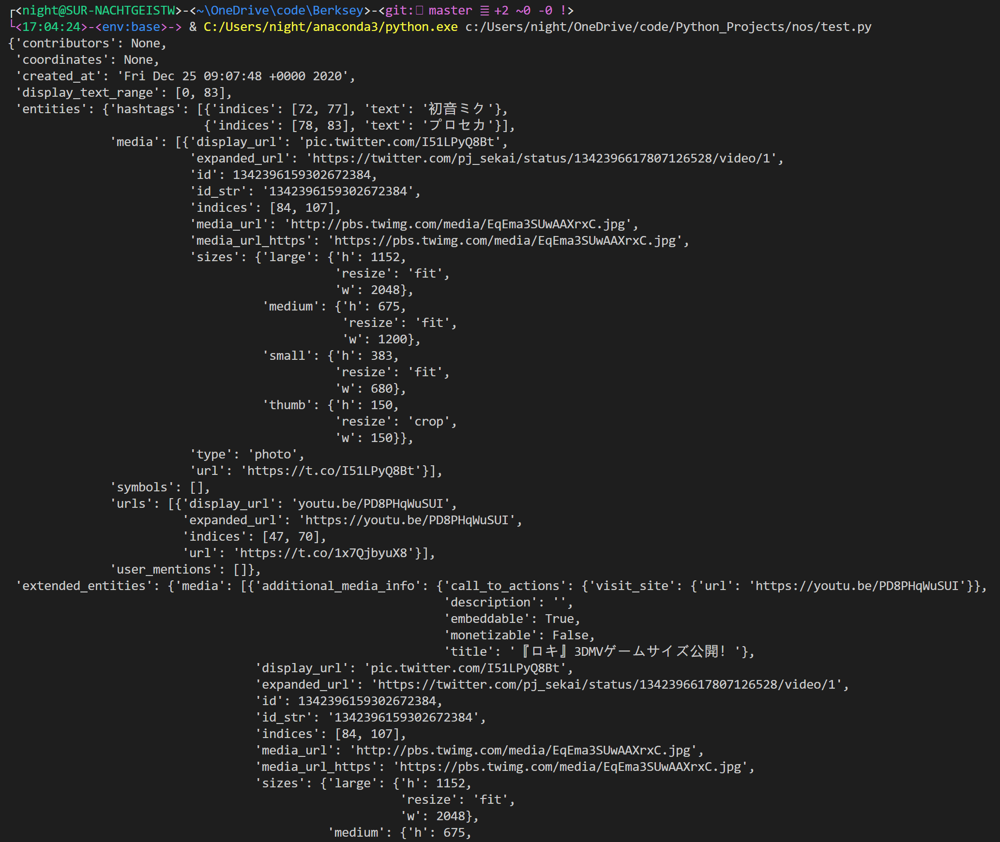

> 不过 Twitter 现在可能是唯一一家主力 api 还用 1 的（
> 
> ——w 君

事件的起因是我一时兴起，准备用 Mirai 做一个推文同步 bot，用来实时同步 Project Sekai 官推的推文。

<!-- more -->

## 准备工作

### 查找 API 接口

我问了一下 Xs! 他是如何实现他的推文同步功能的，得到的答复是可以用官方的 [Get Tweet timelines](https://developer.twitter.com/en/docs/twitter-api/v1/tweets/timelines/overview) API。

之前跟 Twitter 对线的时候成功拿到的 developer 账号虽然闲置了快一年，但还是可以用。

打开文档，看到列表里有一个 ：

| API endpoint | Description |
| :--- | :-- |
| GET statuses / user_timeline | Returns a collection of the most recent Tweets posted by the indicated by the `screen_name` or `user_id` parameters. |

那这个就是我们要的 API 了。

Twitter 的 API 根据 OAuth 版本相对应地分了两个版本：1.1（对应 1.0a）和 2（对应 2）。1.1 的 API URL 一般是

```url
https://api.twitter.com/1.1/XXX1/XXX2.json
```

这里，XXX1 填 `statuses`，XXX2 填 `user_timeline`。那 URL 就变成了这样：

```url
https://api.twitter.com/1.1/statuses/user_timeline.json
```

另外列表里说明了这个 API 要用 GET 来获取数据。嗯，想想也是，毕竟只是用来拉取用户的时间流。

### 尝试使用 API

因为官方文档的 FAQ 里，图片无一幸免全部挂掉了，我有点担心这个 API 已经被弃用了，所以需要写个小程序试试 API 还能不能用。

首先要去 Twitter Developers 建立一个新的 App，拿到 API key & secret 以及 Access token & secret。后面会用到。至于怎么建立，这里就不详述了，总之不只是发申请那么简单，有可能要用英语跟 Twitter 对线，所以做好准备（



众所周知，Python 拥有较快的开发速度，而且拥有丰富的包。所以我用了 Python 来做测试。

```Python
import requests
import os
import json
from authlib.integrations.requests_client import OAuth1Session
from authlib.integrations.requests_client import OAuth1Auth
from pprint import pprint

proxies = {
    'http': '127.0.0.1:1080',
    'https': '127.0.0.1:1080'
}

api_key = "api_key"
api_key_secret = "api_key_secret"

access_token = "access_token"
access_token_secret = "nRmLq53U6jx6dhpDmHyTbdQUws2i6CjZB0aASzKwco4m2"
auth = OAuth1Auth(
    client_id=api_key,
    client_secret=api_key_secret,
    token=access_token,
    token_secret=access_token_secret,
)

url = "https://api.twitter.com/1.1/statuses/user_timeline.json"
payload = {'screen_name': 'pj_sekai'}
r = requests.get(url, auth=auth, proxies=proxies, params=payload)

pprint(r.json()[1])
```

由于人在国内，所以额外加了一个 `proxies` 设置。

结果如下。



还算幸运，这个 API 还能用。

## 实现过程

既然能用，那就可以尝试用 C++ 调用它了。

### 通信需要的参数

根据 Twitter 的 [Authorizing a request](https://developer.twitter.com/en/docs/authentication/oauth-1-0a/authorizing-a-request) 页，我们需要的参数除了 oauth_consumer_key、oauth_consumer_secret、oauth_token 和 oauth_token_secret 之外，还需要一些别的东西：

- oauth_timestamp：这个是发起 oauth 验证时的时间戳。
- oauth_nonce：这个是一个长度为 32 的，随机生成的，并使用 Base64 加密过后的字符串。
- oauth_signature_method：签名用的方法。写 `HMAC-SHA1` 就行。
- oauth_version：OAuth 版本。这里是 `1.0`。

timestamp 的获取方法十分简单，使用 C++ 自带的 `<chrono>` 就可以了。

```C++
const auto ms = std::chrono::duration_cast<std::chrono::seconds>(
    std::chrono::system_clock::now().
    time_since_epoch());
return std::to_string(ms.count());
```

oauth_nonce 的获取有点困难。为了安全要求，这串字符必须是强随机、不可预测的。这里我用了 sodium 库的 `randombytes_buf()` 方法来生成 32 位的字节流。[^ref1]生成完之后再用 Base64 加密。

## 后记

从动念头到程序正式跑通，前前后后总计花了两个星期还多。期间的过程虽然非常折腾，但是学到了很多东西。我觉得这不算亏。

特别感谢 w 君。没有他陪着我折腾，这个程序根本写不出来。

## 参考资料与注释

[^ref1]: https://doc.libsodium.org/generating_random_data#usage
