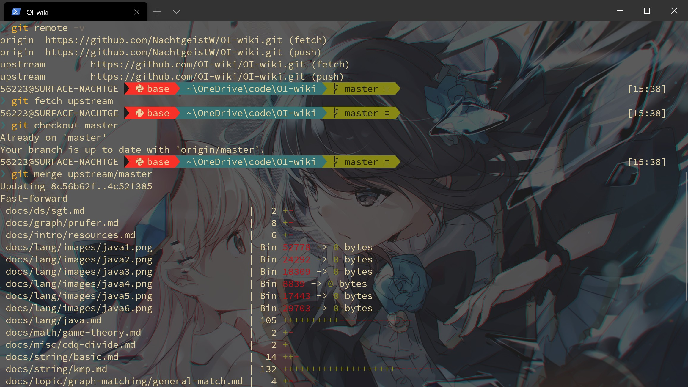

主要是脑子越来越不好使了，写下来防止忘记。

<!-- more -->

## 本地分支与上游分支同步

（其实这种东西完全搜得到……单纯怕忘。）

```Bash
git remote -v  查看有无上游代码库

（如果没有 upstream）git remote add upstream url 添加 upstream

git remote -v 再次检查

git fetch upstream  拉取上游代码库的更新

git checkout master  切换到 master 分支

git merge upstream/master  合并
```

比如说跟 OI-wiki 的上游分支同步。



## git 的代理

只说对 GitHub 的。浏览器的话直接挂好代理一般就行了，主要是在终端使用的时候很麻烦。

只对 GitHub 设置 socks5 代理：`git config --global http.https://github.com.proxy socks5://127.0.0.1:1080`

取消代理：`git config --global --unset http.https://github.com.proxy`

设置完代理后 clone 就很快，但是用 https push 的话就会报:

> fatal: NoSupportedException encountered.
>
> ServicePointManager 不支持具有 socks5 方案的代理。

所以还得在本地也配置一下代理：

`git config --global http.proxy http://127.0.0.1:1080`

`git config --global https.proxy https://127.0.0.1:1080`

## 参考文档

[Github进行fork后如何与原仓库同步：重新fork很省事，但不如反复练习版本合并
](https://github.com/selfteaching/the-craft-of-selfteaching/issues/67)

[git 设置和取消代理](https://gist.github.com/laispace/666dd7b27e9116faece6)（作者给的是无效的，但是后面的回复里有有效的）

[Git 代理配置方案](https://wiki.imalan.cn/archives/Git%20%E4%BB%A3%E7%90%86%E9%85%8D%E7%BD%AE%E6%96%B9%E6%A1%88/)
