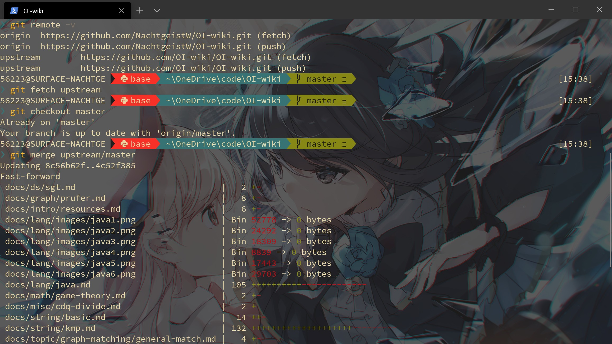

主要是脑子越来越不好使了，写下来防止忘记。

<!-- more -->

## git 的代理

~~`git config --global http.proxy http://127.0.0.1:1080`~~

~~好像只配置这一个就够用了。~~

有一个更好的做法。参见[Windows 下为各类 CLI 设置代理](set-proxy-for-cli.md)。

## 强制取消本地更改

### 使用远程分支覆盖本地

这是最佳的方式。

```Bash
git fetch --all
（以下两个二选一）
git reset --hard origin/master
git reset --hard origin/<branch_name>
```

### 直接删掉

`git clean -f`

直白点就是把本地乱七八糟的更改全都扬了。比较适合多了很多乱七八糟文件的情况，比如 OneDrive 同步被搞炸的时候：[](image/2020-06-17_19-56-58.png)

有时需要加上 `-d`，把目录下所有未同步的更改全删了。

官方的帮助文档是这样说的：

>usage: `git clean [-d] [-f] [-i] [-n] [-q] [-e <pattern>] [-x | -X] [--] <paths>...`
>
>     -q, --quiet           do not print names of files removed
>     -n, --dry-run         dry run
>     -f, --force           force
>     -i, --interactive     interactive cleaning
>     -d                    remove whole directories
>     -e, --exclude <pattern>
>                           add <pattern> to ignore rules
>     -x                    remove ignored files, too
>     -X                    remove only ignored files

## 本地分支与上游分支同步

（其实这种东西完全搜得到……单纯怕忘。）

```Bash
git remote -v               # 查看有无上游代码库
git remote add upstream url #（如果没有 upstream）添加 upstream
git remote -v               # 再次检查
git fetch upstream          # 拉取上游代码库的更新
git checkout master         # 切换到 master 分支
git merge upstream/master   # 合并
git pull upstream master    # 上面三条可以合成一条
```

比如说跟 OI-wiki 的上游分支同步。

[](image/2020-06-01_15-42-00.jpg)

## 参考文档

[git 设置和取消代理](https://gist.github.com/laispace/666dd7b27e9116faece6)（作者给的是无效的，但是后面的回复里有有效的）

[Git 代理配置方案](https://wiki.imalan.cn/archives/Git%20%E4%BB%A3%E7%90%86%E9%85%8D%E7%BD%AE%E6%96%B9%E6%A1%88/)

[Github进行fork后如何与原仓库同步：重新fork很省事，但不如反复练习版本合并](https://github.com/selfteaching/the-craft-of-selfteaching/issues/67)

[version control - How do I force "git pull" to overwrite local files? - Stack Overflow](https://stackoverflow.com/questions/1125968/how-do-i-force-git-pull-to-overwrite-local-files)
