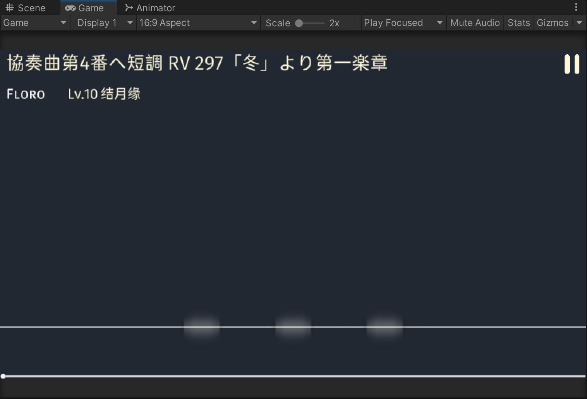

---
title: 从 ObjectPool 复用 GameObject 时从头开始播放 Animation
date: 2022/09/10
updated: 2022/09/10
category: 
- Unity3D
tag: 
- Unity3D
- C#
- Animator
- Animation
---

我在写音游里的一个功能。

音游里有很多音符，游戏里借助了 Unity 原生的 [`ObjectPool`](https://docs.unity3d.com/ScriptReference/Pool.ObjectPool_1.html) 实现了它们的生成与回收。我希望当游戏中的音符落下来，播放光效后，再让 ObjectPool 回收它们。

<!-- more -->

## 初始的实现

为了实现它，在游戏的事件管理器里我注册了两个事件（删去了事件的参数）：

```csharp
    public static event Action<> HitNoteEvent;
    public static void CallHitNoteEvent() => HitNoteEvent?.Invoke();

    /// <summary>
    /// Called when the note animation is finished.
    /// </summary>
    public static event Action<> ExecuteActionAfterNoteAnimate;
    public static void CallExecuteActionAfterNoteAnimate() => ExecuteActionAfterNoteAnimate?.Invoke();
```

其中，播放光效的函数放在了 HitNoteEvent 的实现 `OnHitNoteEvent` 内；回收音符 GameObject 的函数则放在了 `ExecuteActionAfterNoteAnimate` 的实现内。这样，当光效播放完毕后，再调用 `CallExecuteActionAfterNoteAnimate()` 就可以将其回收。另外，在之前的开发中我发现，如果在 HitNoteEvent 里就将音符回收了，那音符的光效根本就不会播放（因为已经被 `SetActive(false)` 了），所以这么做了。

```csharp
private void OnHitNoteEvent()
{
    explosionAnim = note.GetComponent<Animator>();
    explosionAnim.SetBool("IsHit", true);
}
```

播放光效的动画是依赖 `IsHit` 触发的，在它前面还有个空白的状态（为了避免自动播放），只要将其设为 `true` 就能让它切换到光效播放状态开始播放了。

`ExecuteAfterNoteAnimate` 的实现则很简单，只有一行：

```csharp
private void ExecuteAfterNoteAnimate(Note note)
{
    EventHandler.CallExecuteActionAfterNoteAnimate(note);
}
```

直接呼叫事件就可以了，NoteController 那边实现了这个方法，它会处理回收音符的事情。

## 实现真正的延迟回收

但是光这样做是不行的。实际跑起来发现，只是这样的话，音符还是会被立刻回收。于是开始思考：有没有一个方法，能够延迟播放，或者让动画等待一段时间后再播放？

在群里问了一下，残像给了 `AnimationEvent` 的帮助文档。

读了文档。它说可以将 AnimationEvent 附加在 AnimationClip 上，并可以为其传递参数、设置事件触发前的等待时间。而且示例代码演示的刚好就是我需要的功能。于是思路大概就明确下来了：

1. 为音符的 Animator 添加一个 `nimationEvent
2. 将回收函数 `ExecuteAfterNoteAnimate` 添加到这个 AnimationEvent 上，为其添加 fire off 的时间。

修改后的 `OnHitNoteEvent()` 如下：

```csharp
private void OnHitNoteEvent()
{
    var explosionAnimEvent = new AnimationEvent
    {
        functionName = nameof(ExecuteAfterNoteAnimate),
        objectReferenceParameter = note,
        time = Settings.noteAnimationPlayingTime
    };
    explosionAnim = note.GetComponent<Animator>();
    var clip = explosionAnim.runtimeAnimatorController.animationClips[0];
    clip.AddEvent(explosionAnimEvent);
    explosionAnim.SetBool("IsHit", true);
}
```

函数内定义了一个 `AnimationEvent`，初始化的时候就一并定义了它 fire off 的时间、要传递的参数以及要启动的函数的名字。

考虑到以后有变更动画播放时间的可能，所以把 `noteAnimationPlayingTime` 的详细数值写在了 `Setting.cs` 里。给 fire off 的函数名字套一个 `nameof` 是盐酸教的，也是考虑到以后有更改它名字的可能。（小吐槽一下，`functionName` 这里居然只能用函数名的 `string` 调用也太草了……）

## 修 bug

但是，写完后发现了一个问题：当再次从 ObjectPool 里复用的时候，音符光效还是保持在动画的最后一帧，保持着光效已经播放完毕的样子，而不是我希望的“回到未被击中”的第一帧的状态。



猜测大概是因为每次回收音符后没有对 Animator 做复原处理。

在 Unity Answers 和 Stackoverflow 上翻阅大量问答后，我采用的做法是修改 `ExecuteAfterNoteAnimate()`，让其直接 reset Animator。

另外，修改一下动画的逻辑。原本它只有一个从空状态转向播放动画的状态，在 `IsHit` 为 `true` 的时候触发。现在为其多添加一个从播放动画的状态转回空状态的状态，将 `IsHit` 设为 `false` 的时候触发。

修改过后的 `ExecuteAfterNoteAnimate()` 的实现变成了这样：

```csharp
    private void ExecuteAfterNoteAnimate(Note note)
    {
        explosionAnim.Rebind();
        explosionAnim.SetBool("IsHit", false);
        EventHandler.CallExecuteActionAfterNoteAnimate(note);
    }
```

重新绑定一下 `Animator`，然后将 `IsHit` 设置成 `false`，这样动画就能跳回到未播放前的状态。

另外也有尝试将 `Rebind()` 和 `SetBool()` 对调、分别删除这两句留下另一句，但都不成功。总之就是非常奇怪。

## 参考文章

- [Unity - Scripting API: AnimationEvent](https://docs.unity3d.com/ScriptReference/AnimationEvent.html)
- [How to reset animator controller ?](https://answers.unity.com/questions/1490688/how-to-restart-animator-controller.html)
- [（找到了但没有用×1）how to restart mecanim state animation or play it from random position [SOLVED]](https://answers.unity.com/questions/623878/how-to-restart-mecanim-state-animation-or-play-it.html)
- [（找到了但没有用×2）Resetting animation frame to initial position](https://stackoverflow.com/questions/56265476/resetting-animation-frame-to-initial-position)
- [（找到了但没有用×3）Jump to a specific frame in an animation](https://answers.unity.com/questions/181903/jump-to-a-specific-frame-in-an-animation.html)
